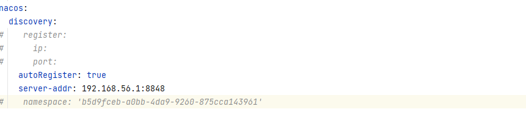
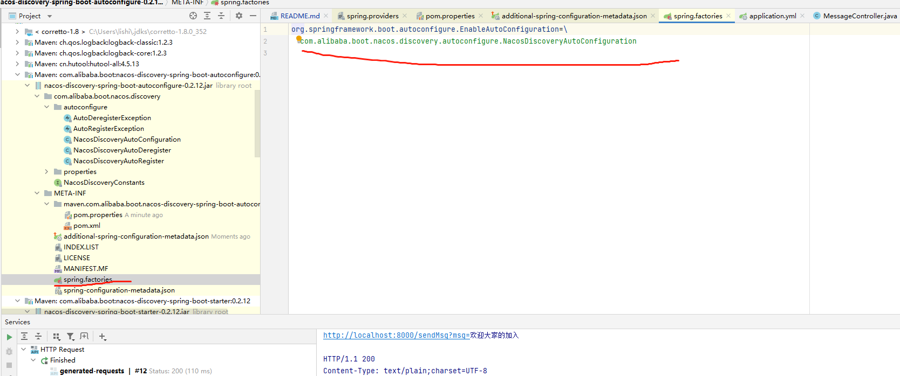
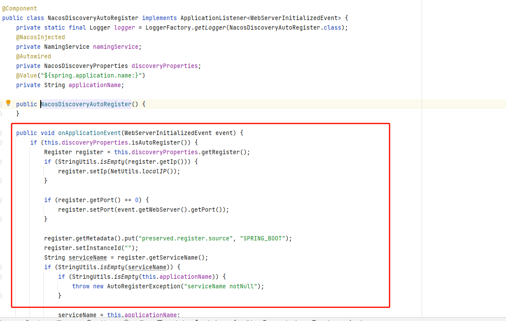
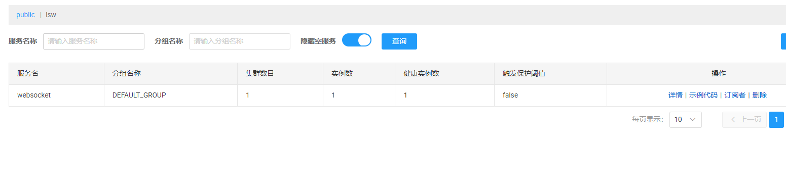
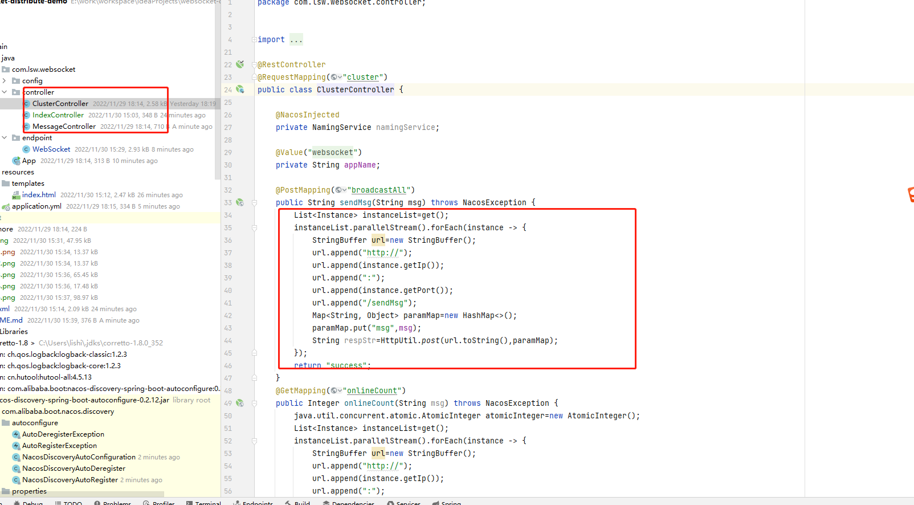
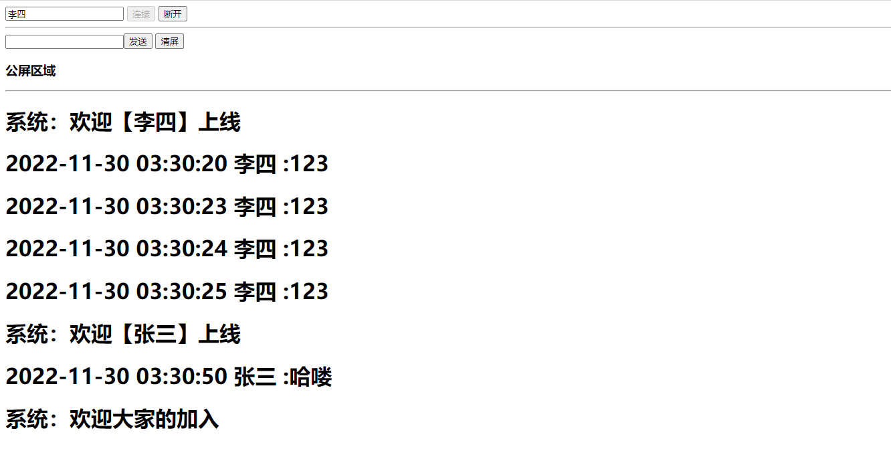

# websocket-distribute-demo
 分布式处理 使用 nacos 作为注册中心,也可以使用其它实现；euraka、consl、zookeeper等

## 下面使用nacos作为例子
+ 配置

+ nacos spring-boot-starter 插件

+ 注册

+ 验证

+ 分布式核心
  
   获取注册的所有节点,操作节点session

+ 演示

